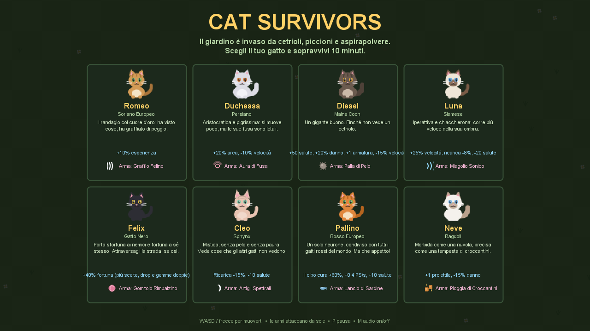
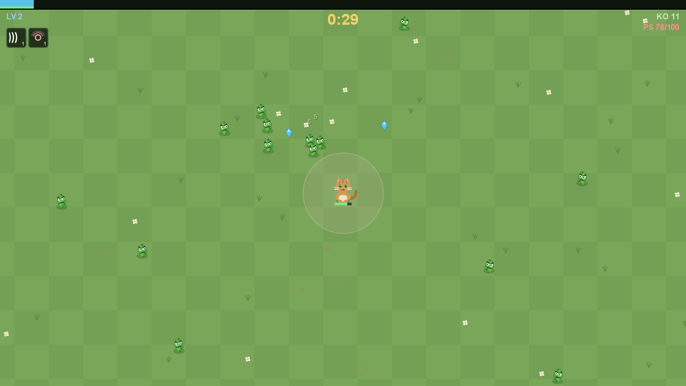

# 🐱 Cat Survivors

Un clone di **Vampire Survivors** scritto in **Java puro (Java2D/AWT)**, dove i protagonisti
sono gatti di razze e caratteri diversi. Il giardino di casa è stato invaso da cetrioli,
piccioni, aspirapolvere e altri incubi felini: scegli il tuo gatto e **sopravvivi 10 minuti**
— da solo o in **co-op online fino a 4 giocatori**.

Zero dipendenze esterne, zero asset: tutta la grafica è disegnata proceduralmente con Java2D,
tutti gli effetti sonori sono sintetizzati a runtime e il networking è TCP puro della libreria
standard. Serve solo un JDK.




## 🌐 Versione Browser (itch.io)

Il gioco è **giocabile direttamente nel browser** senza download su [**itch.io**](https://sonokarol.itch.io) — niente installazione di Java, 
zero configurazione. Supporta **co-op online fino a 4 giocatori** tramite relay WebSocket.

### Giocare online

Visita [**itch.io**](https://sonokarol.itch.io), apri il gioco nel browser e invita i tuoi amici tramite il codice stanza.

### Testare in locale (sviluppatori)

Per compilare e testare il port TypeScript in sviluppo:

```bash
cd web
npm install
npm run dev        # http://localhost:5173  (gioco)
npm run relay      # in un'altra finestra — ws://localhost:8080 (relay co-op)
```

In una scheda clicca **CREA STANZA** (apparirà il codice), in un'altra clicca **ENTRA IN STANZA** e digita il codice.

### Buildare per itch.io

```bash
cd web
npm run pack
```

Produce `cat-survivors-itch.zip` pronto da caricare su itch.io. Per i dettagli tecnici, strategie di deploy e configurazioni del relay, vedi [`web/README.md`](web/README.md).

## Requisiti

- **Per sviluppare/compilare**: JDK 17 o superiore (`javac` e `java` nel PATH) — nessuna libreria esterna, nessun build tool.
- **Per giocare e basta**: nemmeno Java! Vedi la versione portatile qui sotto.

## Versione portatile per gli amici (senza installare Java)

```bat
package.bat
```

Produce `dist\CatSurvivors-windows.zip` (~24 MB): un pacchetto Windows con dentro
`CatSurvivors.exe` e un runtime Java ridotto creato con `jpackage`. Chi lo riceve
**scompatta lo zip e fa doppio clic su `CatSurvivors.exe`** — niente da installare.

Per amici su Mac/Linux invece serve Java ([adoptium.net](https://adoptium.net), Temurin 17+),
poi si gioca col jar: `java -jar CatSurvivors.jar`.

## Come si gioca

```bat
run.bat
```

Oppure manualmente:

```bat
javac -encoding UTF-8 --release 17 -d out src\catsurvivors\*.java
java -cp out catsurvivors.Main
```

Con `build.bat` si crea anche il jar eseguibile `dist\CatSurvivors.jar`
(avviabile con `java -jar dist\CatSurvivors.jar`).

### Passare il gioco agli amici

Dopo `build.bat`, condividi il singolo file **`dist\CatSurvivors.jar`** (≈120 KB) come
preferisci (Drive, WeTransfer, Discord...). Gli amici lo avviano con un doppio clic oppure:

```bat
java -jar CatSurvivors.jar
```

Unico requisito: avere **Java 17+** installato ([adoptium.net](https://adoptium.net) se non ce l'hanno).
Il jar è autosufficiente — niente altri file, niente installazione.

### Controlli

| Tasto | Azione |
|---|---|
| **WASD / Frecce** | Movimento |
| **Mouse** | Mira: i colpi partono verso il cursore (le armi sparano da sole) |
| **Click / 1-4** | Scelta dei potenziamenti al level up |
| **P / Esc** | Pausa |
| **M** | Audio on/off |
| **R** | Torna al menu (a fine partita) |

## Co-op con gli amici (fino a 4 gatti)

Il multiplayer è **host autoritativo su TCP**: l'host simula il mondo, gli ospiti
inviano input e ricevono lo stato a 20 Hz (interpolato lato client).

1. **L'host** sceglie un gatto e clicca **OSPITA CO-OP**: si apre la lobby con l'IP da
   condividere (porta `7777`).
2. **Gli amici** scelgono il proprio gatto, cliccano **UNISCITI A UN AMICO** e inserisco
   l'indirizzo dell'host (es. `192.168.1.10` o `ip:porta`).
3. Quando tutti sono in lobby, l'host preme **INVIO** e si parte.

Note di sopravvivenza di squadra:

- Nemici e boss scalano con il numero di gatti (+60% spawn e +25% vita a gatto extra).
- Ogni level up mette il mondo in pausa mentre il gatto interessato sceglie la carta.
- Chi finisce KO diventa un **fantasma** e osserva; si perde solo se cadono tutti.
- L'esperienza va a chi raccoglie la gemma: niente litigi, ce n'è per tutti.

### Giocare da internet (fuori dalla LAN)

Sulla **stessa rete** funziona subito. Per gli amici fuori casa, il traffico deve
raggiungere il PC dell'host attraverso il router. Tre strade, dalla più comoda:

1. **Port forwarding automatico (UPnP)** — quando ospiti, il gioco prova da solo a
   chiedere al router di aprire la porta 7777 e mostra in lobby l'indirizzo pubblico da
   condividere. Funziona **solo se il router ha UPnP attivo**. Verifica la tua rete con:
   ```bat
   java -cp out catsurvivors.Main --netcheck
   ```
2. **Port forwarding manuale** — nel pannello del router (di solito `192.168.1.1`), inoltra
   la porta **TCP 7777** verso l'IP locale del PC host; poi gli amici usano `IP-pubblico:7777`.
3. **VPN mesh (consigliata se il router non collabora)** — tutti installano
   [Tailscale](https://tailscale.com) (gratis): l'host comunica il proprio IP Tailscale
   `100.x.y.z` e gli amici si uniscono con `100.x.y.z:7777`. Nessuna configurazione del
   router, funziona ovunque.

> La **prima volta** che ospiti, Windows mostra l'avviso del firewall: scegli
> **Consenti accesso** (anche sulle reti pubbliche) o gli amici non riusciranno a connettersi.

## I gatti giocabili

| Gatto | Razza | Carattere | Bonus | Arma iniziale |
|---|---|---|---|---|
| **Romeo** | Soriano Europeo | Il randagio col cuore d'oro | +10% esperienza | Graffio Felino |
| **Duchessa** | Persiano | Aristocratica e pigrissima | +20% area, -10% velocità | Aura di Fusa |
| **Diesel** | Maine Coon | Un gigante buono | +50 salute, +20% danno, +1 armatura, -15% velocità | Palla di Pelo |
| **Luna** | Siamese | Iperattiva e chiacchierona | +25% velocità, ricarica -8%, -20 salute | Miagolio Sonico |
| **Felix** | Gatto Nero | Porta sfortuna ai nemici | +40% fortuna (più scelte, drop e gemme doppie) | Gomitolo Rimbalzino |
| **Cleo** | Sphynx | Mistica, senza pelo e senza paura | Ricarica -15%, -10 salute | Artigli Spettrali |
| **Pallino** | Rosso Europeo | Un solo neurone, tanto appetito | Il cibo cura +60%, +0.4 PS/s, +10 salute | Lancio di Sardine |
| **Neve** | Ragdoll | Morbida come una nuvola | +1 proiettile, -15% danno | Pioggia di Croccantini |

## Le armi

Otto armi potenziabili fino al livello 6, più dieci oggetti passivi (Erba Gatta, Ciotola di
Latte, Zampe Felpate...). Massimo 6 armi e 6 passivi per partita, come da tradizione.

**Graffio Felino** (zampata frontale) • **Gomitolo Rimbalzino** (rimbalza sullo schermo) •
**Palla di Pelo** (lobbata ad arco) • **Aura di Fusa** (danno ad area attorno al gatto) •
**Miagolio Sonico** (onda d'urto perforante) • **Artigli Spettrali** (orbitanti) •
**Lancio di Sardine** (raffica direzionale) • **Pioggia di Croccantini** (bombardamento esplosivo)

## I nemici

Tutto ciò che un gatto teme: **cetrioli** (il classico), piccioni, topi robot, anatre di gomma,
spruzzini d'acqua e aspirapolvere. Ogni minuto arriva un **élite**, e ai minuti 3, 6 e 9
compaiono i boss: il **Roomba 9000**, il **Phon Turbo** e infine il temutissimo
**Dott. Forbici, il Veterinario**. Ogni 2 minuti, un anello di cetrioli ti accerchia.

## Struttura del progetto

```
src/catsurvivors/
├── Main.java        Entry point, finestra e game loop (~60 FPS, BufferStrategy)
├── Game.java        Simulazione: collisioni, ondate, level up, rendering del mondo (host)
├── Player.java      Il gatto: statistiche, armi, esperienza, mira col mouse
├── Enemy.java       Inseguimento del gatto vivo più vicino, contraccolpi
├── Weapons.java     Le 8 armi (statistiche per livello + comportamento)
├── Passives.java    I 10 oggetti passivi
├── Enemies.java     Bestiario, ondate, calendario boss
├── Cats.java        Il roster degli 8 gatti
├── Sprites.java     Tutta la grafica, disegnata proceduralmente con Java2D
├── Sfx.java         Effetti sonori chiptune sintetizzati a runtime
├── Ui.java          Menu, HUD, lobby, level up, pausa, schermate finali
├── Input.java       Tastiera e mouse (thread-safe EDT → game loop)
├── App.java         Collante tra menu, partita locale/host e modalità client
├── Net.java         Protocollo binario del co-op (snapshot, scelte, input)
├── Server.java      Lato host: accept, connessioni, pump sul thread di gioco
├── Client.java      Lato ospite: invio input, ricezione snapshot
├── ClientView.java  Rendering del client con interpolazione tra snapshot
├── Snapshot.java    Fotografia del mondo spedita ai client
├── Upnp.java        Port forwarding automatico via UPnP-IGD (per il co-op da internet)
├── Autotest.java    Smoke test headless della partita in solitaria
├── Cooptest.java    Smoke test headless del co-op (host+client via TCP locale)
└── Netcheck.java    Diagnostica: prova UPnP e mostra l'indirizzo pubblico (--netcheck)
```

## Test

```bat
java -cp out catsurvivors.Main --autotest
java -cp out catsurvivors.Main --cooptest
```

Il primo simula 30 secondi di partita senza finestra (movimento e mira sintetici, level up
automatici), verifica che i nemici muoiano e salva due screenshot. Il secondo avvia un host
con lobby, ci connette un client via TCP su localhost, simula 20 secondi e verifica
registrazione, movimento remoto, uccisioni e il giro completo del level up via rete.


## Licenza

[MIT](LICENSE) — © 2026 SonoKarol
